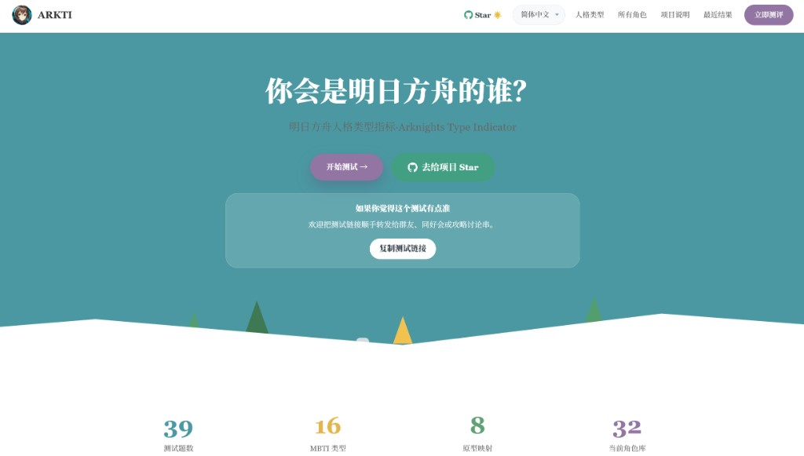
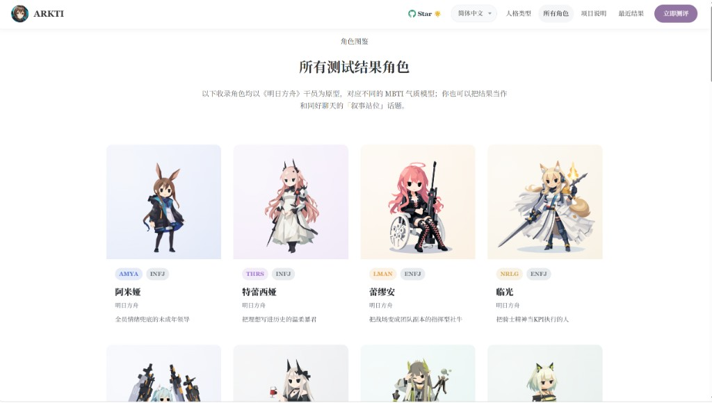
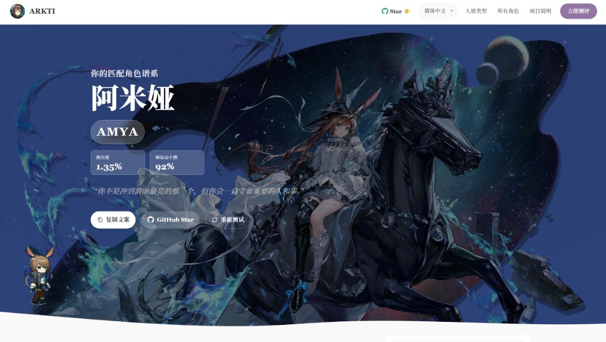

<div align="center">

# ARKTI

**A · R · K · T · I — Arknights Type Indicator**

面向《明日方舟》玩家的 MBTI 轻量测试：把明日方舟语境里常见的「怎么玩、怎么练、怎么在社区里说话」落成干员气质与原型解读。

回答情境式问题 → 获得唯一命中的干员代码 → 与同好对照你的叙事站位（粉丝向娱乐，非官方）

[在线体验](https://arkti.ybwlawa0.com/#/quiz) · [开始贡献](#贡献) · [阅读文档](#工作原理)

> ⚠️ 本工具仅作娱乐用途，不作为心理诊断、医学评估或现实人格结论。本站非《明日方舟》官方内容，与鹰角网络无关联。

</div>

---

## 截图预览

<p align="center">
  
  &nbsp;
  
  &nbsp;
  
</p>

## 特性

- **MBTI 四维判定** — E/I、S/N、T/F、J/P 四维度作为底层框架
- **8 种二次元原型** — 发光主角位 · 冰面观察者 · 誓约队长 · 灵巧回旋者 · 温柔修复者 · 影面策士 · 混沌火花 · 月下守护者
- **干员角色库** — 以《明日方舟》干员为原型的 MBTI 映射（持续扩充）
- **维度可视化** — 16personalities 风格的交互式倾向滑块
- **分享海报** — 一键导出结果为 PNG
- **纯前端运行** — 无后端、无注册、无数据收集，结果存于本地

## 在线体验

**[https://arkti.ybwlawa0.com/#/quiz](https://arkti.ybwlawa0.com/#/quiz)**

部署于 Cloudflare Pages，全球 CDN 加速。

## 贡献

欢迎 **Star** · 欢迎 **Fork** · 欢迎 **PR**！

当前项目仍处于早期阶段，题目数量和角色库都还不够丰富。如果你有好的情境题目想法或想补充更多作品的角色，非常期待你的参与：

- 补充新角色 → 编辑 `src/data/characters.json`
- 添加新题目 → 编辑 `src/data/questions.json`
- 修复 Bug / 改进 UI → 直接提 PR

仓库已配置 GitHub Actions CI，会在 `push` 到 `main` 和所有 PR 上自动执行 `npm ci` 与 `npm run build`，用于确认静态站点能够正常构建。线上部署仍由 Cloudflare Pages 负责。

## 技术栈

<p align="center">
  
  
  
  
  
  
  
</p>

## 项目结构

```
src/
├── components/           # 可复用 UI 组件
│   ├── AppIcon.vue
│   ├── ProgressBar.vue
│   ├── QuestionCard.vue
│   ├── ResultSummary.vue
│   ├── SharePoster.vue
│   └── AdsenseSlot.vue
├── composables/          # Vue 组合式函数
│   ├── useQuiz.ts       # 测试状态与逻辑
│   └── useShare.ts      # 分享与导出功能
├── data/                # 静态数据
│   ├── questions.json   # 39 道情境式题目
│   ├── archetypes.json  # 8 个角色原型定义
│   ├── characters.json  # 角色资料库
│   ├── characterVisuals.json       # 角色视觉配置
│   └── characterProbabilities.json # 角色命中概率
├── pages/               # 页面组件
│   ├── HomePage.vue     # 首页
│   ├── IntroPage.vue    # 测试说明页
│   ├── QuizPage.vue     # 答题页
│   ├── ResultPage.vue   # 结果展示页
│   ├── CharactersPage.vue # 角色图鉴页
│   └── AboutPage.vue    # 关于页
├── types/
│   └── quiz.ts          # TypeScript 类型定义
├── utils/
│   ├── quizEngine.ts    # 评分、原型匹配、角色命中逻辑
│   ├── characterVisuals.ts    # 角色视觉数据注水
│   ├── characterProbability.ts # 角色命中概率计算
│   ├── adsense.ts       # Google AdSense 配置
│   └── storage.ts       # localStorage 工具
├── router/
│   └── index.ts         # 路由配置
├── App.vue              # 根组件
├── main.ts              # 入口文件
└── style.css            # 全局样式
```

## 工作原理

```
答题（39 道七级量表题）→ 算分（四维带符号权重 + 原型权重）→ 原型匹配（映射到 8 种原型）→ 角色命中（输出唯一角色代码）→ 结果展示
```

1. **答题** — 39 道七级量表题（-3 到 +3），每题关联一个 MBTI 维度与原型权重
2. **算分** — 按维度累加带符号权重，计算每个维度的倾向百分比（50%–100%）
3. **原型匹配** — 将四维结果映射到 8 种二次元原型之一
4. **角色命中** — 根据维度结果在角色库中命中 1 位主角色，输出其自定义角色代码
5. **结果展示** — 角色代码、维度倾向滑块、角色解析、原型描述，支持导出海报

## 本地开发

```bash
# 安装依赖
npm install

# 启动开发服务器
npm run dev

# 构建
npm run build
```

构建产物输出到 `dist/`，配置为相对路径（`base: './'`），可直接部署到 Cloudflare Pages 等静态托管平台。

## 持续集成与部署

- GitHub Actions：负责在 `main` push / PR 时校验构建是否通过
- Cloudflare Pages：负责连接 GitHub 后的自动构建与部署
- GitHub Release：在推送 `v*` tag 时自动构建 `dist/`、打包为 zip，并创建 Release

发版方式示例：

```bash
git tag v0.1.0
git push origin v0.1.0
```

## 内容数据

| 文件 | 说明 |
|:-----|:-----|
| `src/data/questions.json` | 39 道情境式题目 — 维度、原型权重、场景标签 |
| `src/data/archetypes.json` | 8 个角色原型 — 名称、描述、亮点、短板 |
| `src/data/characters.json` | 32 个角色条目 — 角色代码、MBTI 映射、标签、六维向量 |
| `src/data/characterVisuals.json` | 角色视觉配置 — 立绘、色彩、主题 |
| `src/data/characterProbabilities.json` | 角色命中概率 — 基于人群统计的先验分布 |

## 致谢

- **界面风格** — 参考自 [16personalities](https://www.16personalities.com/) 的扁平化设计与专业测评体验
- **项目启发** — 受到开源项目 [UnluckyNinja/SBTI-test](https://github.com/UnluckyNinja/SBTI-test) 的启发
- **视觉素材** — 项目中的角色立绘与背景图片由 **ChatGPT (DALL·E)** 生成

## 产品边界

- 纯静态前端，无后端服务、无用户系统、无数据库
- 不作为心理诊断或医学评估工具
- 测试结果保存于浏览器 localStorage
- 不收集任何个人信息

## Star History

[](https://github.com/YBWLawa0/ARKTI/stargazers)

<a href="https://star-history.com/#YBWLawa0/ARKTI&Date">
  
</a>

<div align="center">

---


**[⬆ 回到顶部](#arkti)**

</div>
